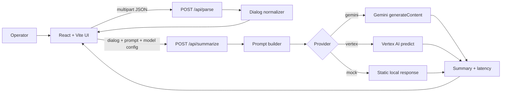
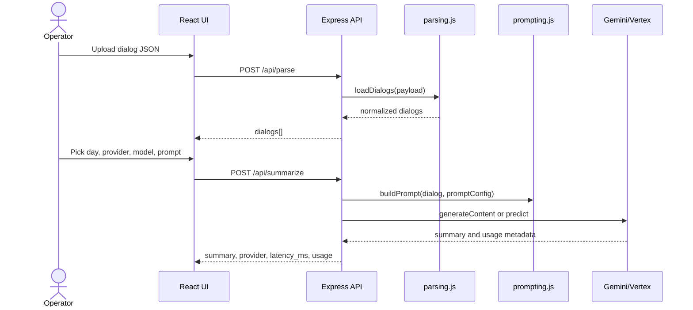

# Dialog Summary Studio

Dialog Summary Studio is a full-stack tool for testing how LLM providers summarize
messenger-style dialogs. It turns raw JSON exports into normalized conversations,
lets an operator tune prompts and model parameters, and records latency/token usage
for every summary run.

The project is intentionally small enough to run locally, but structured like a
production evaluation surface: provider adapters are isolated, prompt construction
is deterministic, secrets stay in environment variables, and Docker Compose brings
up the whole system with one command.

## What It Does

- Uploads a JSON dialog export from the browser.
- Normalizes multiple input shapes into a consistent `dialog -> messages` model.
- Filters a dialog by day before summarization, useful for long conversations.
- Builds compact prompts with sender normalization, URL masking, message truncation,
  and consecutive-message merging.
- Runs summaries through `mock`, direct Gemini API, or Vertex AI endpoint providers.
- Captures latency and Gemini token usage in the UI.
- Supports batch summarization from the backend API.
- Includes Gemini rate-limit probes for capacity and retry tuning.

## Impact

This project reduces manual dialog review work by converting long support or
community conversations into compact, auditable summaries. The useful engineering
impact is not only "LLM calls from a UI"; it is the evaluation loop around those
calls:

- Prompt changes are testable without redeploying backend code.
- Model, temperature, and output-token settings are visible at run time.
- Long dialogs are made safer for LLM limits through deterministic compaction.
- Rate-limit scripts make provider limits measurable before production rollout.
- Token and latency metrics help compare quality/cost tradeoffs across models.

## Architecture





More details: [docs/architecture.md](docs/architecture.md).

## Tech Stack

- Frontend: React 18, TypeScript, Vite, nginx container
- Backend: Node.js, Express, Multer, Google Auth Library
- Model providers: mock, Gemini API, Vertex AI Endpoint
- Deployment: Docker Compose
- Tooling: standalone Node.js scripts for Gemini rate-limit tests

## Quick Start

1. Create `.env` from the example:

```bash
cp .env.example .env
```

2. Start the project:

```bash
docker compose up --build
```

3. Open:

- Frontend: `http://localhost:5173`
- Backend health: `http://localhost:8000/api/health`
- Backend metadata: `http://localhost:8000/api/meta`

4. Upload [samples/dialogs.json](samples/dialogs.json), select a dialog/day, tune the
prompt, and press `Start`.

The default provider is `mock`, so the app works without cloud credentials.

## Gemini Mode

Set these values in `.env`:

```env
BESCO_MODEL_PROVIDER=gemini
VITE_MODEL_PROVIDER=gemini
BESCO_GEMINI_API_KEY=your-gemini-api-key
BESCO_GEMINI_MODEL=gemini-2.5-flash
BESCO_GEMINI_API_BASE=https://generativelanguage.googleapis.com
BESCO_GEMINI_API_VERSION=v1beta
```

The backend also supports OAuth access tokens and Vertex-style Gemini endpoints
through `BESCO_GEMINI_ACCESS_TOKEN`, `BESCO_GEMINI_API_BASE`, and
`BESCO_GEMINI_API_VERSION`.

## Vertex Endpoint Mode

```env
BESCO_MODEL_PROVIDER=vertex
VITE_MODEL_PROVIDER=vertex
BESCO_VERTEX_PROJECT_ID=your-project-id
BESCO_VERTEX_LOCATION=us-central1
BESCO_VERTEX_ENDPOINT_ID=your-endpoint-id
```

Optional templates:

```env
BESCO_VERTEX_INSTANCE_TEMPLATE={"prompt":"{prompt}"}
BESCO_VERTEX_PARAMETERS_TEMPLATE={"temperature":0.2,"maxOutputTokens":512}
```

## API

### `GET /api/health`

Returns service status and active default provider.

### `GET /api/meta`

Returns supported providers, limits, and feature capabilities for UI or automation.

### `POST /api/parse`

Accepts multipart form data with a `file` field containing JSON. Returns normalized
dialogs:

```json
{
  "dialogs": [
    {
      "dialog_id": "101_202_0",
      "ru_name": "Regional User",
      "tu_name": "Target User",
      "messages": [
        { "sender": "RU", "timestamp": "2026-06-18 09:15", "text": "..." }
      ]
    }
  ]
}
```

### `POST /api/summarize`

```json
{
  "dialog": {
    "dialog_id": "101_202_0",
    "messages": [
      { "sender": "RU", "timestamp": "2026-06-18 09:15", "text": "Can we sync today?" }
    ]
  },
  "prompt": {
    "system_instruction": "You summarize dialogs in clear English.",
    "rules": ["Use only details present in the dialog."],
    "output_instruction": "Return exactly one paragraph.",
    "max_message_chars": 700,
    "max_merged_line_chars": 900
  },
  "parameters": {
    "temperature": 0.2,
    "maxOutputTokens": 300
  },
  "model": {
    "provider": "gemini",
    "model_name": "gemini-2.5-flash"
  }
}
```

Response:

```json
{
  "summary": "The participants agreed to sync today and confirm final details.",
  "latency_ms": 842,
  "provider": "gemini",
  "usage": {
    "prompt_tokens": 128,
    "output_tokens": 23,
    "thoughts_tokens": 0,
    "total_tokens": 151
  }
}
```

### `POST /api/summarize-batch`

Accepts `dialogs[]` with the same `prompt`, `parameters`, and `model` shape, then
returns `items[]` with one summary result per dialog.

## Input JSON Formats

The parser accepts:

- A single object with `messages`.
- An object with `dialogs`.
- An object with `data`.
- A raw array of dialog objects.
- A raw array of message-like objects.

Message text can live in `text`, `message`, `content`, `body`, `caption`, or nested
objects. Sender fields include `from`, `sender`, `from_id`, `author`, and
`initiator`. Timestamp fields include `timestamp`, `date`, `datetime`, `time`,
`created_at`, `createdAt`, and `ts`.

## Operational Controls

Gemini reliability and cost controls are environment-driven:

```env
BESCO_GEMINI_RETRY_MAX_ATTEMPTS=2
BESCO_GEMINI_RETRY_BASE_DELAY_MS=1500
BESCO_GEMINI_RETRY_MAX_DELAY_MS=12000
BESCO_GEMINI_PROMPT_CHAR_BUDGETS=16000,12000,8000
BESCO_GEMINI_INITIAL_PROMPT_CHAR_BUDGET=16000
BESCO_GEMINI_THINKING_BUDGET=0
BESCO_GEMINI_THINKING_BUDGET_CAP=512
BESCO_GEMINI_DEFAULT_MAX_OUTPUT_TOKENS=300
BESCO_GEMINI_MAX_OUTPUT_TOKENS_CAP=512
```

## Rate-Limit Tools

Run a fixed-size concurrent Gemini batch:

```bash
node tools/gemini-batch-test.js 100
```

Run progressive waves until the first configured 429 threshold:

```bash
node tools/gemini-rate-limit-test.js
```

Both scripts read `.env` and print status counts, latency stats, and first 429
details when rate limits are reached.

## Project Structure

```text
backend/
  src/
    server.js      Express API and request orchestration
    parsing.js     Input JSON normalization
    prompting.js   Prompt construction and compaction
    gemini.js      Gemini client, retries, usage parsing
    vertex.js      Vertex Endpoint adapter
    logging.js     Redacted structured log helpers
frontend/
  src/
    App.tsx        Main evaluation UI
    defaultPrompt.ts
tools/
  gemini-batch-test.js
  gemini-rate-limit-test.js
docs/
  architecture.md
samples/
  dialogs.json
```

## Security Notes

- Do not commit `.env`; use `.env.example` for configuration shape.
- API keys and OAuth tokens are redacted from backend logs.
- CORS origins are allow-listed with `BESCO_CORS_ORIGINS`.
- Upload parsing uses in-memory files and a JSON-only application flow.

## Development Checks

```bash
cd frontend
npm run build
```

```bash
node -c backend/src/server.js
node -c backend/src/gemini.js
node -c backend/src/parsing.js
node -c backend/src/prompting.js
node -c backend/src/vertex.js
```

## Roadmap

- Persist evaluation runs and compare model versions over time.
- Add golden-set scoring for summary quality.
- Add role-based access and project/team workspaces.
- Add streaming generation for long-running providers.
