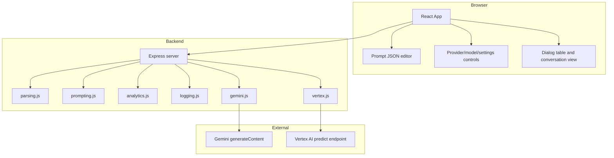
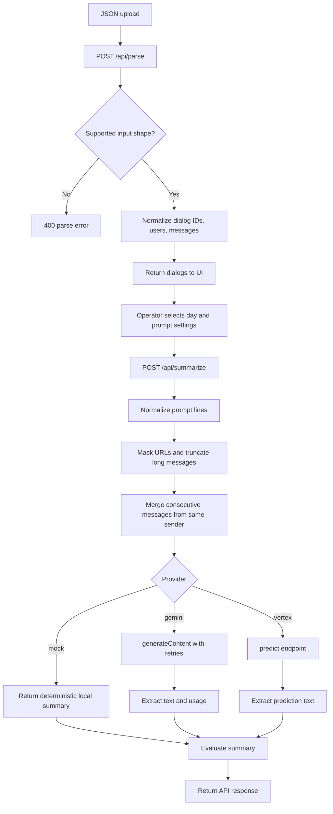
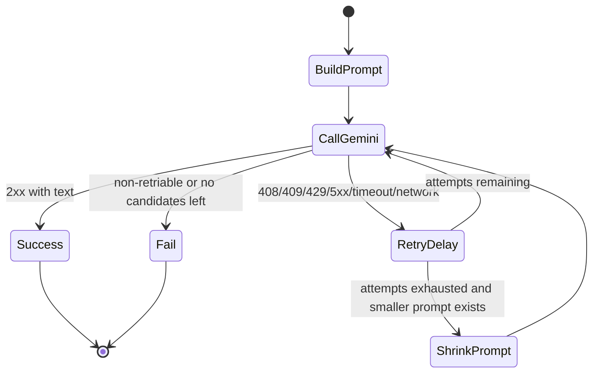

# Architecture

Dialog Summary Studio has three boundaries: browser UI, Express API, and model
provider adapters. Each boundary keeps one responsibility clear so provider
experiments do not leak into parsing or frontend state management.

## Component View



## Request Lifecycle



## Provider Strategy

The backend chooses providers at request time from `model.provider`, falling back
to `BESCO_MODEL_PROVIDER`. This keeps the deployment flexible:

- `mock` is deterministic and works without credentials.
- `gemini` supports direct API-key calls or OAuth bearer token calls.
- `vertex` supports custom endpoint IDs and JSON request templates.

Provider-specific logic lives behind `GeminiClient.generate()` and
`VertexClient.predict()`. The API route receives the same high-level tuple from
both real providers: summary text and latency; Gemini additionally returns token
usage metadata.

## Evaluation Layer

`analytics.js` is deliberately deterministic. It does not ask a model to judge
another model. Instead, it calculates repeatable signals that are useful for
model comparison and product demos:

- Source volume: messages, participants, words, characters, days, duration.
- Summary compactness: words, characters, compression ratio.
- Retrieval signal: overlap against top source keywords.
- Impact estimate: reading minutes saved at 220 words per minute.
- Quality gates: concise output, substantive output, keyword coverage, latency,
  and token budget when usage metadata is available.

This makes every run auditable and keeps the evaluation layer cheap enough to run
for mock, Gemini, and Vertex providers.

## Reliability Controls



Gemini requests use exponential backoff with jitter and honor `Retry-After` when
present. When retries are exhausted for one prompt size, the client can retry with
smaller prompt budgets. This is intentionally deterministic: the most recent dialog
lines are retained first because they usually contain the actionable context.

## Data Contracts

### Normalized Dialog

```json
{
  "dialog_id": "101_202_0",
  "ru_name": "Regional User",
  "tu_name": "Target User",
  "ru_id": 101,
  "tu_id": 202,
  "messages": [
    {
      "sender": "RU",
      "timestamp": "2026-06-18 09:15",
      "text": "Can we sync today?"
    }
  ]
}
```

### Summary Result

```json
{
  "summary": "The participants agreed to sync today.",
  "latency_ms": 842,
  "provider": "gemini",
  "usage": {
    "prompt_tokens": 128,
    "output_tokens": 23,
    "thoughts_tokens": 0,
    "total_tokens": 151
  },
  "evaluation": {
    "summary": {
      "compression_ratio": 0.18,
      "keyword_coverage": 0.42,
      "estimated_time_saved_minutes": 3.6
    },
    "quality": {
      "score": 80,
      "gates": [
        {
          "id": "concise",
          "label": "Concise output",
          "status": "pass",
          "detail": "summary/source word ratio 0.18"
        }
      ]
    }
  }
}
```

## Why This Shape Is Maintainable

- Parsing, prompting, and provider calls can be tested independently.
- UI state reflects user workflow instead of provider implementation details.
- Provider secrets remain backend-only.
- Prompt budgets and output token caps are controlled by environment variables.
- Model capacity tests live outside the product path in `tools/`.
- Evaluation metrics are deterministic, cheap, and provider-agnostic.
